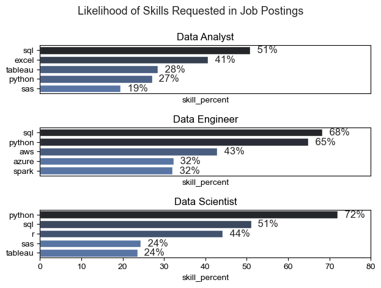
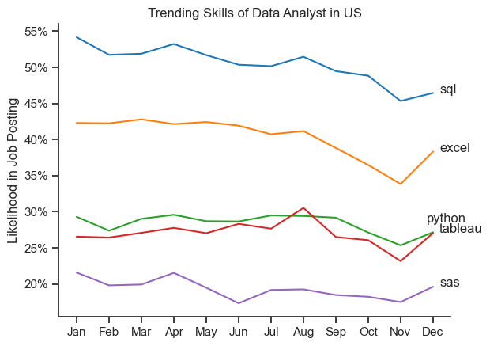
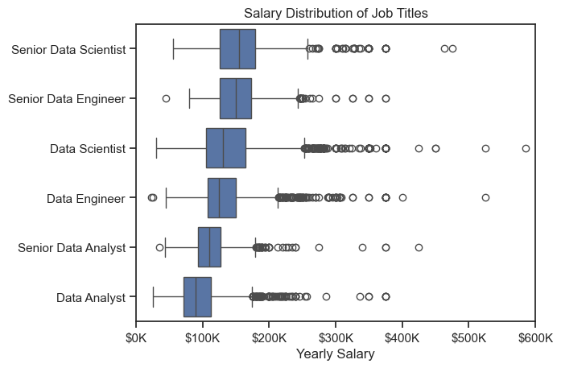
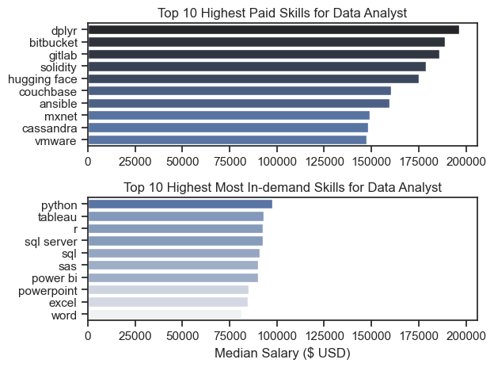
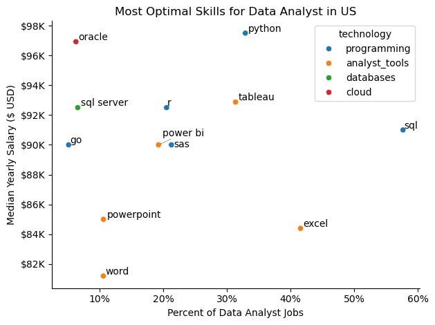

# Overview

The goal of this project is to conduct a comprehensive analysis of the job market, particularly focusing on Data Analyst roles in US by evaluating key skills in terms of their demand and associated salary levels. The analysis focuses on identifying the most valuable and in-demand skills for data analysts and provides insights into the trends, salary distributions, and optimal skills that can guide professionals in their career development.

# Tools Used

1. Python
2. Visual Studio Code
3. Jupyter Notebooks
4. Git & GitHub

# Questions to Answer

1. What are the most demanded skills for the top 3 most popular data roles?

2. How are in-demand skills trending for Data Analysts?

3. How well do jobs and skills pay for Data Analysts?

4. What is the most optimal skill to learn for Data Analysts? (High Demand and High Paying)

# The Analysis

## 1. What are the most demanded skills for the top 3 popular roles?

To find the top 3 popular skills the data for "United States" is first filtered out and then grouped the skills by job title. Using the grouped data, the skill counts is calculated across each job title and identified the top 3 popular jobs and the respective most demanded skill. This query shows the skills, one should pay should pay attention depending on the role I am targeting.

View my notebook here for detailed steps here: [2.Skills Demand.ipynb](3_Project/2_Skills_Demand.ipynb)

### Visualize data

```python

fig , ax = plt.subplots(len(job_titles),1)

sns.set_theme(style='ticks')

for i, job_title in enumerate(job_titles):
    df_plot = df_skills_percent[df_skills_percent['job_title_short'] == job_title].head(5)
    sns.barplot(df_plot, x='skill_percent', y='job_skills', ax=ax[i], hue='skill_percent', palette='dark:b_r', legend=False) 
    ax[i].set_title(job_title)
    ax[i].set_ylabel('')
    ax[i].legend().set_visible(False)
    ax[i].set_xlim(0,80)

    for n, v in enumerate(df_plot['skill_percent']):
        ax[i].text(v+1, n, f'{v: .0f}%', va='center')
    
    if i!= len(job_titles) - 1:
        ax[i].set_xticks([])

fig.suptitle('Likelihood of Skills Requested in Job Postings', fontsize=13)
fig.tight_layout()
plt.show()

```

## Results



[2.Skills Demand.ipynb](3_Project/2_Skills_Demand.ipynb)

## Insights

SQL is a common requirement across all three roles, though its importance is highest for Data Engineers. Python is crucial for both Data Scientists and Data Engineers but is less emphasized for Data Analysts. Visualization tools like Tableau are more associated with Data Analyst roles, while cloud platforms like AWS and Azure are more relevant for Data Engineers.

## 2. How are in-demand skills for Data Analysts?

To find the top 5 demanded skills the Data Analyst from United States jobs are filtered out. It is then grouped by skills for each month and the percentage of skill demand for each month is calculated. This query shows the trend of demanded skills for Data Analysts over time.

View my notebook here for detailed steps here: [3.Skills Demand.ipynb](3_Project/3_Skills_Trend.ipynb)

### Visualize data

```python
df_plot = df_DA_US_percent.iloc[:,:5]

sns.set_theme(style='ticks')

sns.lineplot(df_plot, dashes=False, palette='tab10')

plt.title('Trending Skills of Data Analyst in US')
plt.xlabel('')
plt.ylabel('Likelihood in Job Posting')
plt.legend().remove()

from matplotlib.ticker import PercentFormatter
ax = plt.gca()
ax.yaxis.set_major_formatter(PercentFormatter(decimals=0))

for i in range(5):
    if (int(df_plot.iloc[-1, i])) != (int(df_plot.iloc[-1, i-1])):
        print(df_plot.iloc[-1, i])
        plt.text(11.2,df_plot.iloc[-1, i], df_plot.columns[i])
    else:
        plt.text(10.8,(df_plot.iloc[-1, i]+1.5), df_plot.columns[i])

sns.despine()
```
## Results



[3.Skills Trend.ipynb](3_Project/3_Skills_Trend.ipynb)

## Insights
SQL and Excel are consistently the most demanded skills, although both show a downward trend towards the end of the year. Python and Tableau follow a similar trajectory, peaking in mid-year but declining towards the end. SAS remains steady but lower in demand throughout the year. For aspiring Data Analysts, proficiency in SQL and Excel is critical, as these skills remain highly demanded throughout the year.Keeping up-to-date with Python and Tableau can also be beneficial, especially given their peaks mid-year.

## 3. How well do jobs and skills pay align?

### Salary Distribution by Job titles

For this task, the top 6 jobs are filtered out for "United States" and then the median salary is calculated. This query shows how the salary is distributed for the top 6 jobs.

View my notebook here for detailed steps here: [4.Salary Analysis.ipynb](3_Project/4_Salary_Analysis.ipynb)

### Visualize data

```python
sns.boxplot(df_US_top6, x='salary_year_avg', y='job_title_short', order=job_top6_order)
sns.set_theme(style='ticks')
ax = plt.gca()
ax.xaxis.set_major_formatter(plt.FuncFormatter(lambda x, pos : f'${int(x/1000)}K'))
plt.title('Salary Distribution of Job Titles')
plt.xlim(0,600000)
plt.xlabel('Yearly Salary')
plt.ylabel('')
```

## Results



[4.Salary Analysis.ipynb](3_Project/4_Salary_Analysis.ipynb)

## Insights

There is a clear progression in median salaries from Data Analyst to Senior Data Scientist, reflecting the increasing responsibility, expertise, and specialization required for each role. Senior roles (both Data Scientists and Data Engineers) have the highest salary ranges and the most outliers, indicating that these positions have the highest earning potential.The step up from Data Analyst to Senior Data Analyst is significant but not as pronounced as the jump from mid-level to senior roles in Data Science and Engineering.

### Median Salary Vs Skills Pay for Data Analysts

For this comparison, the median salary for the top paid skills and most demanded skills for the Data Analysts is calculated by grouping the job titles by salary. This query shows how much different/same the top paid skills and most demanded skills and the difference in median salaries could be.

View my notebook here for detailed steps here: [4.Salary Analysis.ipynb](3_Project/4_Salary_Analysis.ipynb)

### Visualize data

```python
fig , ax = plt.subplots(2,1)
sns.set_theme(style='ticks')
sns.barplot(data=df_DA_US_top_pay, x='median',y=df_DA_US_top_pay.index, ax=ax[0], hue='median', palette="dark:b_r", legend=False)
ax[0].set_title('Top 10 Highest Paid Skills for Data Analyst')
ax[0].set_xlabel('')
ax[0].set_ylabel('')

sns.barplot(data=df_DA_US_top_skill, x='median',y=df_DA_US_top_skill.index, ax=ax[1], hue='median', palette="light:b", legend=False)
ax[1].set_title('Top 10 Highest Most In-demand Skills for Data Analyst')
ax[1].set_xlabel('Median Salary ($ USD)')
ax[1].set_ylabel('')
ax[1].set_xlim(ax[0].get_xlim())
fig.tight_layout()
```

## Results



[4.Salary Analysis.ipynb](3_Project/4_Salary_Analysis.ipynb)

## Insights

The highest paid skills are typically more specialized and not the most commonly required skills in job postings, but they offer higher compensation due to their niche nature. In contrast, the most in-demand skills are essential for a broad range of data analyst positions but offer relatively lower median salaries.


## What is the most optimal skill to learn for Data Analysts?

For this task, the the median salary for the top paid skills and most demanded skills for the Data Analysts is calculated by grouping the job titles by salary. The technology domain is transformed to a list of skills for each technology. Then both the data is merged to get the percentage of skills count from the job postings for each job is determined. This query the shows the most optimal skills required for Data Analysts and their technology domain.

View my notebook here for detailed steps here: [5.Optimal Skills.ipynb](3_Project/5_Optimal_Skills.ipynb)

### Visualize data

```python
from adjustText import adjust_text 
from matplotlib.ticker import PercentFormatter

sns.scatterplot(df_plot, x='skill_percent', y='median_salary', hue='technology')

plt.title('Most Optimal Skills for Data Analyst in US')
plt.xlabel('Percent of Data Analyst Jobs')
plt.ylabel('Median Yearly Salary ($ USD)')

texts = []

for i , txt in enumerate(df_DA_skills_high_demand.index):
    texts.append(plt.text(df_DA_skills_high_demand['skill_percent'].iloc[i], df_DA_skills_high_demand['median_salary'].iloc[i], txt))

adjust_text(texts, arrowprops=dict(arrowstyle="->", color='grey', lw=0.5))    

ax = plt.gca()
ax.yaxis.set_major_formatter(plt.FuncFormatter(lambda y, pos: f'${int(y/1000)}K'))
ax.xaxis.set_major_formatter(PercentFormatter(decimals=0))

sns.despine()
plt.tight_layout()
plt.show()
```

## Results



[5.Optimal Skills.ipynb](3_Project/5_Optimal_Skills.ipynb)

## Insights

SQL, Python, and Tableau are among the most optimal skills for Data Analysts, balancing high demand with strong salaries.Skills like Oracle and SQL Server, though less common, offer higher salaries and are valuable for those looking to specialize in specific areas. PowerPoint and Word, while essential for general tasks, do not offer the same level of compensation or demand as technical skills.

# Learnings

1. Market Demand and Skill Prioritization : By analyzing the likelihood of different skills being requested in job postings, I gained insights into which skills are most sought after in the data field. 

2. Data Visualization and Interpretation : Working on this project reinforced the importance of data visualization and improved my skills in interpreting market data to communicate complex information in a more understandable and effective manner.

3. Strategic Skill Development : This analysis provided insights into the trade-offs between focusing on niche, high-paying skills versus commonly required skills. 


# Conclusion

This project serves as a detailed market analysis for data analysts in the US, providing actionable insights into skill demand, salary trends, and optimal skill combinations. By leveraging the findings from these charts, data analysts can make informed decisions about their career paths, skill development, and potential salary negotiations.


